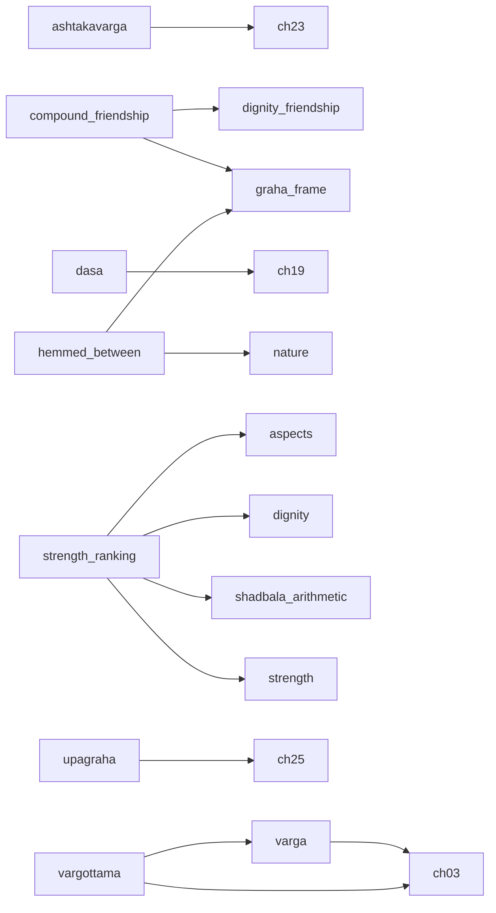

# Phase 3 — highest-return work order

Generated by `Rules/tools/leverage.py` from the deferred-knowledge registry. **Do not edit by hand.**

The store holds **504** cards, of which **487** are executable and **17** are recorded but blocked. This document ranks what to build next by how much of that blocked knowledge each capability releases.

Encoding effort is measured, not guessed: across the chapters already encoded the corpus yields **0.64 cards per paragraph**, and each deferred chapter is costed from its own paragraph count at that rate. Code effort is an estimate, declared per dependency in `Rules/deferred.json` with its basis.

## Why "cards blocked" is the wrong ranking

Most inert cards declare several dependencies and become executable only when the *last* one lands. Implementing the single most-cited capability on its own therefore usually releases nothing at all. Both numbers are shown below so the difference is visible.

| Dependency | Kind | Cards blocked | Entries | Solo unlock | Closure unlock | Effort | Return |
|---|---|---:|---:|---:|---:|---:|---:|
| `dep.triped-sign-class` — the 'triped' sign class | reference | 1 | 1 | 1 | 1 | 1 | 1.00 |
| `dep.vargottama` — vargottama extractor | predicate | 1 | 1 | 1 | 3 | 14 | 0.21 |
| `dep.second-nativity` — a second nativity | schema | 1 | 2 | 1 | 1 | 5 | 0.20 |
| `dep.prashna` — prashna (horary) branch | engine | 1 | 1 | 1 | 1 | 6 | 0.17 |
| `dep.varga` — varga (divisional chart) engine | calculator | 5 | 6 | 2 | 2 | 13 | 0.15 |
| `dep.adjudication` — Stage 7 adjudication | engine | 1 | 12 | 1 | 1 | 8 | 0.12 |
| `dep.universal-quantification` — universal quantification over a variable-membership set | schema | 1 | 1 | 1 | 1 | 15 | 0.07 |
| `dep.dasa` — vimshottari dasa engine | calculator | 3 | 6 | 1 | 1 | 16 | 0.06 |
| `dep.manual-verification` — human verification of the encoding | process | 2 | 9 | 1 | 1 | 20 | 0.05 |
| `dep.strength-ranking` — ordinal comparison of graha strength | calculator | 2 | 2 | 1 | 1 | 40 | 0.03 |
| `dep.ashtakavarga` — ashtakavarga | calculator | 1 | 3 | 0 | 0 | 25 | 0.00 |
| `dep.body-part-significator` — house-to-body-part correspondence | predicate | 1 | 1 | 0 | 0 | 2 | 0.00 |
| `dep.chandra-kriya` — Chandrakriya, Chandra Avastha and Chandravela | calculator | 0 | 3 | 0 | 0 | 5 | 0.00 |
| `dep.compound-friendship` — compound (Panchadha maitri) friendship tiers | predicate | 1 | 1 | 0 | 0 | 6 | 0.00 |
| `dep.day-night` — whether the birth was by day or by night | calculator | 0 | 0 | 0 | 0 | 3 | 0.00 |
| `dep.declination` — declination north or south | calculator | 0 | 0 | 0 | 0 | 3 | 0.00 |
| `dep.degree-range` — comparing a graha's degree in its sign against a range | schema | 0 | 0 | 0 | 0 | 3 | 0.00 |
| `dep.hemmed-between` — hemming (papakartari / subhakartari) extractor | predicate | 0 | 0 | 0 | 0 | 6 | 0.00 |
| `dep.kendra-togetherness` — what "together in a Kendra" means | concept | 1 | 1 | 0 | 0 | 1 | 0.00 |
| `dep.lagna-strength` — strength verdict for the Lagna/Ascendant | predicate | 0 | 1 | 0 | 0 | 5 | 0.00 |
| `dep.paksha` — the lunar fortnight as a fact | predicate | 0 | 0 | 0 | 0 | 2 | 0.00 |
| `dep.shadbala-arithmetic` — the Shadbala component arithmetic Phaladeepika withholds | doctrine | 0 | 4 | 0 | 0 | 13 | 0.00 |
| `dep.transit` — transit (gochara) calculation | calculator | 3 | 4 | 0 | 0 | 6 | 0.00 |
| `dep.upagraha` — upagraha computation | calculator | 0 | 3 | 0 | 0 | 11 | 0.00 |
| `dep.weekday-hora-lords` — which graha rules each weekday and each hora | reference | 0 | 1 | 0 | 0 | 2 | 0.00 |
| `dep.yoga-combination-count` — counting how many sibling yoga-conditions are simultaneously true | schema | 0 | 1 | 0 | 0 | 8 | 0.00 |

*Solo unlock* — cards that become executable if only this lands. *Closure unlock* — cards that become executable if this and everything it itself needs land, including the corpus chapters carrying the doctrine it must read. *Return* is closure unlock ÷ effort.

## The dependency graph

Edges point from a capability to what it needs. `ch.N` is a corpus chapter that must be encoded first, because the doctrine the capability reads is printed there and the engine may not hardcode it.

## Recommended order

| Step | Build | Also requires | Chapters first | Cost | Cards released | Running total executable |
|---:|---|---|---|---:|---:|---:|
| 1 | `dep.triped-sign-class` — the 'triped' sign class | — | — | 1 | +1 | 488 |
| 2 | `dep.vargottama` — vargottama extractor | `dep.varga` | ch. 03 | 14 | +3 | 491 |
| 3 | `dep.second-nativity` — a second nativity | — | — | 5 | +1 | 492 |
| 4 | `dep.transit` — transit (gochara) calculation | — | — | 6 | +1 | 493 |
| 5 | `dep.prashna` — prashna (horary) branch | — | — | 6 | +1 | 494 |
| 6 | `dep.dasa` — vimshottari dasa engine | — | ch. 19 | 16 | +2 | 496 |
| 7 | `dep.adjudication` — Stage 7 adjudication | — | — | 8 | +1 | 497 |
| 8 | `dep.strength-ranking` — ordinal comparison of graha strength | `dep.shadbala-arithmetic` | — | 26 | +2 | 499 |
| 9 | `dep.universal-quantification` — universal quantification over a variable-membership set | — | — | 15 | +1 | 500 |
| 10 | `dep.manual-verification` — human verification of the encoding | — | — | 20 | +1 | 501 |
| 11 | `dep.body-part-significator` — house-to-body-part correspondence | — | — | 2 | +1 | 502 |
| 12 | `dep.ashtakavarga` — ashtakavarga | — | ch. 23 | 25 | +1 | 503 |

Completing this sequence costs **144 units** and moves executable cards from **487** to **503** — releasing **16 of the 17** currently blocked cards.

## What encoding a chapter today would actually buy

The ranking above counts only cards that already exist. The larger effect is on the cards not yet written: a chapter whose rules are stated in lordship, aspect, benefic/malefic, dignity, dasa or varga terms will be encoded into cards that are born inert. The share of each chapter's paragraphs that use that vocabulary is measured below.

| Chapter | Paragraphs | Est. cards | Would be born inert | |
|---:|---:|---:|---:|---|
| 1 | 82 | 53 | 1% | encoded |
| 2 | 84 | 54 | 4% | encoded |
| 3 | 61 | 39 | 59% |  |
| 4 | 163 | 105 | 20% | encoded |
| 5 | 25 | 16 | 48% |  |
| 6 | 236 | 152 | 3% | encoded |
| 7 | 84 | 54 | 11% |  |
| 8 | 141 | 91 | 1% | encoded |
| 9 | 37 | 24 | 11% | encoded |
| 10 | 40 | 26 | 18% | encoded |
| 11 | 43 | 28 | 26% |  |
| 12 | 84 | 54 | 18% |  |
| 13 | 71 | 46 | 11% |  |
| 14 | 84 | 54 | 8% |  |
| 15 | 94 | 61 | 12% |  |
| 16 | 77 | 50 | 10% |  |
| 17 | 67 | 43 | 45% |  |
| 18 | 37 | 24 | 30% |  |
| 19 | 66 | 42 | 68% |  |
| 20 | 114 | 73 | 64% |  |
| 21 | 117 | 75 | 88% |  |
| 22 | 72 | 46 | 68% |  |
| 23 | 115 | 74 | 38% |  |
| 24 | 92 | 59 | 33% |  |
| 25 | 48 | 31 | 4% |  |
| 26 | 203 | 131 | 1% |  |
| 27 | 16 | 10 | 6% |  |
| 28 | 4 | 3 | 0% |  |

Across the 21 unencoded chapters that is roughly **1013 cards**, of which about **326 (32%) would be inert on arrival** if they were encoded before the missing capabilities exist.

## Cards that no sequence here releases

11 card(s) remain blocked after every step above, because they depend on capabilities with no path that pays for itself yet:

- `PD.02.AdverseDisposition` — dep.combust, dep.dignity, dep.varga, dep.condition-variables
- `PD.02.Disease.FollowsTemperament` — dep.condition-variables, dep.adjudication
- `PD.06.Pushkala` — dep.compound-friendship, dep.kendra-togetherness
- `PD.09.Dignity.Inimical` — dep.dignity, dep.condition-variables, dep.dasa
- `PD.09.Vargottama` — dep.vargottama, dep.condition-variables
- `PD.10.Marriage.Dasha7` — dep.lord-of-house, dep.dasa, dep.aspects, dep.transit
- `PD.10.Marriage.StrongerDasha` — dep.condition-variables, dep.dasa, dep.lord-of-house, dep.strength-ranking, dep.transit, dep.varga
- `PD.10.Marriage.TransitTrine` — dep.lord-of-house, dep.transit, dep.varga
- `PD.10.Venus.VargaMarsSaturn` — dep.varga, dep.aspects
- `PD.10.WifeChart.Houses7And8` — dep.nature, dep.aspects, dep.second-nativity
- `PD.10.WifeRashi.Trine` — dep.lord-of-house, dep.condition-variables, dep.varga, dep.ashtakavarga, dep.dignity

