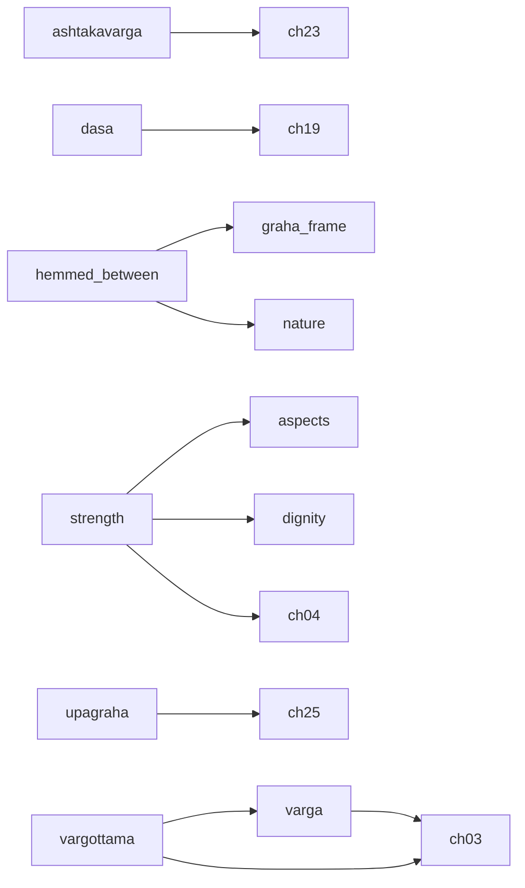

# Phase 3 — highest-return work order

Generated by `Rules/tools/leverage.py` from the deferred-knowledge registry. **Do not edit by hand.**

The store holds **351** cards, of which **333** are executable and **18** are recorded but blocked. This document ranks what to build next by how much of that blocked knowledge each capability releases.

Encoding effort is measured, not guessed: across the chapters already encoded the corpus yields **0.57 cards per paragraph**, and each deferred chapter is costed from its own paragraph count at that rate. Code effort is an estimate, declared per dependency in `Rules/deferred.json` with its basis.

## Why "cards blocked" is the wrong ranking

Most inert cards declare several dependencies and become executable only when the *last* one lands. Implementing the single most-cited capability on its own therefore usually releases nothing at all. Both numbers are shown below so the difference is visible.

| Dependency | Kind | Cards blocked | Entries | Solo unlock | Closure unlock | Effort | Return |
|---|---|---:|---:|---:|---:|---:|---:|
| `dep.vargottama` — vargottama extractor | predicate | 1 | 1 | 1 | 3 | 13 | 0.23 |
| `dep.second-nativity` — a second nativity | schema | 1 | 2 | 1 | 1 | 5 | 0.20 |
| `dep.varga` — varga (divisional chart) engine | calculator | 5 | 5 | 2 | 2 | 12 | 0.17 |
| `dep.prashna` — prashna (horary) branch | engine | 1 | 1 | 1 | 1 | 6 | 0.17 |
| `dep.strength` — planetary and house strength (Stage 4) | calculator | 7 | 9 | 6 | 6 | 37 | 0.16 |
| `dep.adjudication` — Stage 7 adjudication | engine | 1 | 7 | 1 | 1 | 8 | 0.12 |
| `dep.dasa` — vimshottari dasa engine | calculator | 3 | 6 | 1 | 1 | 14 | 0.07 |
| `dep.manual-verification` — human verification of the encoding | process | 1 | 3 | 1 | 1 | 20 | 0.05 |
| `dep.ashtakavarga` — ashtakavarga | calculator | 1 | 2 | 0 | 0 | 22 | 0.00 |
| `dep.hemmed-between` — hemming (papakartari / subhakartari) extractor | predicate | 0 | 0 | 0 | 0 | 6 | 0.00 |
| `dep.transit` — transit (gochara) calculation | calculator | 3 | 4 | 0 | 0 | 6 | 0.00 |
| `dep.upagraha` — upagraha computation | calculator | 0 | 1 | 0 | 0 | 10 | 0.00 |
| `dep.yoga-combination-count` — counting how many sibling yoga-conditions are simultaneously true | schema | 0 | 1 | 0 | 0 | 8 | 0.00 |

*Solo unlock* — cards that become executable if only this lands. *Closure unlock* — cards that become executable if this and everything it itself needs land, including the corpus chapters carrying the doctrine it must read. *Return* is closure unlock ÷ effort.

## The dependency graph

Edges point from a capability to what it needs. `ch.N` is a corpus chapter that must be encoded first, because the doctrine the capability reads is printed there and the engine may not hardcode it.

## Recommended order

| Step | Build | Also requires | Chapters first | Cost | Cards released | Running total executable |
|---:|---|---|---|---:|---:|---:|
| 1 | `dep.vargottama` — vargottama extractor | `dep.varga` | ch. 03 | 13 | +3 | 336 |
| 2 | `dep.second-nativity` — a second nativity | — | — | 5 | +1 | 337 |
| 3 | `dep.strength` — planetary and house strength (Stage 4) | — | ch. 04 | 31 | +6 | 343 |
| 4 | `dep.transit` — transit (gochara) calculation | — | — | 6 | +1 | 344 |
| 5 | `dep.dasa` — vimshottari dasa engine | — | ch. 19 | 14 | +3 | 347 |
| 6 | `dep.prashna` — prashna (horary) branch | — | — | 6 | +1 | 348 |
| 7 | `dep.adjudication` — Stage 7 adjudication | — | — | 8 | +1 | 349 |
| 8 | `dep.manual-verification` — human verification of the encoding | — | — | 20 | +1 | 350 |
| 9 | `dep.ashtakavarga` — ashtakavarga | — | ch. 23 | 22 | +1 | 351 |

Completing this sequence costs **125 units** and moves executable cards from **333** to **351** — releasing **18 of the 18** currently blocked cards.

## What encoding a chapter today would actually buy

The ranking above counts only cards that already exist. The larger effect is on the cards not yet written: a chapter whose rules are stated in lordship, aspect, benefic/malefic, dignity, dasa or varga terms will be encoded into cards that are born inert. The share of each chapter's paragraphs that use that vocabulary is measured below.

| Chapter | Paragraphs | Est. cards | Would be born inert | |
|---:|---:|---:|---:|---|
| 1 | 82 | 46 | 4% | encoded |
| 2 | 84 | 48 | 11% | encoded |
| 3 | 61 | 35 | 66% |  |
| 4 | 163 | 92 | 59% |  |
| 5 | 25 | 14 | 52% |  |
| 6 | 236 | 134 | 8% | encoded |
| 7 | 84 | 48 | 15% |  |
| 8 | 141 | 80 | 5% | encoded |
| 9 | 37 | 21 | 16% | encoded |
| 10 | 40 | 23 | 25% | encoded |
| 11 | 43 | 24 | 30% |  |
| 12 | 84 | 48 | 19% |  |
| 13 | 71 | 40 | 20% |  |
| 14 | 84 | 48 | 10% |  |
| 15 | 94 | 53 | 21% |  |
| 16 | 77 | 44 | 27% |  |
| 17 | 67 | 38 | 45% |  |
| 18 | 37 | 21 | 30% |  |
| 19 | 66 | 37 | 70% |  |
| 20 | 114 | 65 | 67% |  |
| 21 | 117 | 66 | 89% |  |
| 22 | 72 | 41 | 71% |  |
| 23 | 115 | 65 | 38% |  |
| 24 | 92 | 52 | 33% |  |
| 25 | 48 | 27 | 6% |  |
| 26 | 203 | 115 | 1% |  |
| 27 | 16 | 9 | 19% |  |
| 28 | 4 | 2 | 0% |  |

Across the 22 unencoded chapters that is roughly **984 cards**, of which about **371 (38%) would be inert on arrival** if they were encoded before the missing capabilities exist.

## Cards that no sequence here releases

16 card(s) remain blocked after every step above, because they depend on capabilities with no path that pays for itself yet:

- `PD.01.Kalapurusha.Strength` — dep.nature, dep.aspects, dep.lord-of-house, dep.strength, dep.condition-variables
- `PD.02.AdverseDisposition` — dep.combust, dep.dignity, dep.varga, dep.condition-variables
- `PD.02.Disease.FollowsTemperament` — dep.condition-variables, dep.adjudication
- `PD.02.Form.Mars.Youthful` — dep.lord-of-house, dep.strength
- `PD.09.Dignity.Inimical` — dep.dignity, dep.condition-variables, dep.dasa
- `PD.09.Vargottama` — dep.vargottama, dep.condition-variables
- `PD.10.Lord7.BeneficStrong` — dep.lord-of-house, dep.condition-variables, dep.nature, dep.strength
- `PD.10.Marriage.Dasha7` — dep.lord-of-house, dep.dasa, dep.aspects, dep.transit
- `PD.10.Marriage.StrongerDasha` — dep.lord-of-house, dep.condition-variables, dep.varga, dep.strength, dep.dasa, dep.transit
- `PD.10.Marriage.TransitTrine` — dep.lord-of-house, dep.transit, dep.varga
- `PD.10.Venus.VargaMarsSaturn` — dep.varga, dep.aspects
- `PD.10.WeakMoon5.Malefics` — dep.nature, dep.strength, dep.nature-occupancy
- `PD.10.WifeChart.Houses7And8` — dep.nature, dep.aspects, dep.second-nativity
- `PD.10.WifeChildren.EvenSigns` — dep.lord-of-house, dep.condition-variables, dep.strength, dep.sign-class, dep.combust
- `PD.10.WifeDirection.Strongest` — dep.lord-of-house, dep.strength
- `PD.10.WifeRashi.Trine` — dep.lord-of-house, dep.condition-variables, dep.varga, dep.ashtakavarga, dep.dignity

