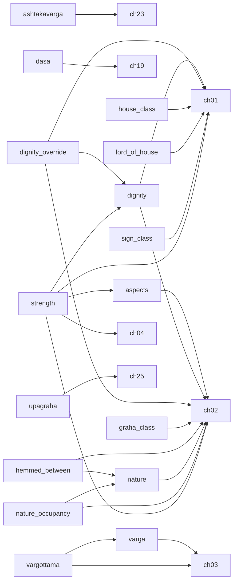

# Phase 3 — highest-return work order

Generated by `Rules/tools/leverage.py` from the deferred-knowledge registry. **Do not edit by hand.**

The store holds **262** cards, of which **221** are executable and **41** are recorded but blocked. This document ranks what to build next by how much of that blocked knowledge each capability releases.

Encoding effort is measured, not guessed: across the chapters already encoded the corpus yields **0.87 cards per paragraph**, and each deferred chapter is costed from its own paragraph count at that rate. Code effort is an estimate, declared per dependency in `Rules/deferred.json` with its basis.

## Why "cards blocked" is the wrong ranking

Most inert cards declare several dependencies and become executable only when the *last* one lands. Implementing the single most-cited capability on its own therefore usually releases nothing at all. Both numbers are shown below so the difference is visible.

| Dependency | Kind | Cards blocked | Entries | Solo unlock | Closure unlock | Effort | Return |
|---|---|---:|---:|---:|---:|---:|---:|
| `dep.graha-frame` — houses counted from a graha | schema | 1 | 1 | 1 | 1 | 2 | 0.50 |
| `dep.rule-transfer` — rule-transfer mechanism | schema | 1 | 1 | 1 | 1 | 3 | 0.33 |
| `dep.manual-verification` — human verification of the encoding | process | 1 | 2 | 1 | 1 | 20 | 0.05 |
| `dep.nature` — benefic/malefic classification | calculator | 16 | 16 | 1 | 1 | 20 | 0.05 |
| `dep.hemmed-between` — hemming (papakartari / subhakartari) extractor | predicate | 0 | 0 | 0 | 1 | 22 | 0.05 |
| `dep.nature-occupancy` — occupancy of a house by grahas of a given nature | predicate | 3 | 3 | 0 | 1 | 22 | 0.05 |
| `dep.adjudication` — Stage 7 adjudication | engine | 0 | 5 | 0 | 0 | 8 | 0.00 |
| `dep.ashtakavarga` — ashtakavarga | calculator | 1 | 2 | 0 | 0 | 31 | 0.00 |
| `dep.aspects` — aspect engine | predicate | 11 | 12 | 0 | 0 | 21 | 0.00 |
| `dep.combust` — combustion extractor | predicate | 3 | 3 | 0 | 0 | 2 | 0.00 |
| `dep.condition-variables` — variables in the condition language | schema | 22 | 22 | 0 | 0 | 5 | 0.00 |
| `dep.conjunct` — conjunction extractor | predicate | 0 | 1 | 0 | 0 | 1 | 0.00 |
| `dep.dasa` — vimshottari dasa engine | calculator | 6 | 8 | 0 | 0 | 19 | 0.00 |
| `dep.dignity` — dignity extractor | predicate | 11 | 11 | 0 | 0 | 39 | 0.00 |
| `dep.dignity-override` — dignity-override mechanism | schema | 2 | 2 | 0 | 0 | 42 | 0.00 |
| `dep.graha-class` — graha classification | reference | 1 | 1 | 0 | 0 | 19 | 0.00 |
| `dep.house-class` — house classification | reference | 1 | 1 | 0 | 0 | 19 | 0.00 |
| `dep.lord-of-house` — lord_of_house extractor | predicate | 18 | 20 | 0 | 0 | 20 | 0.00 |
| `dep.moon-frame` — the Moon as an alternative reference frame | schema | 1 | 1 | 0 | 0 | 2 | 0.00 |
| `dep.occupant-count` — occupant counting | predicate | 3 | 3 | 0 | 0 | 3 | 0.00 |
| `dep.second-nativity` — a second nativity | schema | 1 | 2 | 0 | 0 | 5 | 0.00 |
| `dep.sign-class` — sign classification | reference | 2 | 2 | 0 | 0 | 19 | 0.00 |
| `dep.strength` — planetary and house strength (Stage 4) | calculator | 6 | 6 | 0 | 0 | 86 | 0.00 |
| `dep.transit` — transit (gochara) calculation | calculator | 3 | 4 | 0 | 0 | 6 | 0.00 |
| `dep.upagraha` — upagraha computation | calculator | 0 | 1 | 0 | 0 | 13 | 0.00 |
| `dep.varga` — varga (divisional chart) engine | calculator | 5 | 5 | 0 | 0 | 16 | 0.00 |
| `dep.vargottama` — vargottama extractor | predicate | 1 | 1 | 0 | 0 | 17 | 0.00 |

*Solo unlock* — cards that become executable if only this lands. *Closure unlock* — cards that become executable if this and everything it itself needs land, including the corpus chapters carrying the doctrine it must read. *Return* is closure unlock ÷ effort.

## The dependency graph

Edges point from a capability to what it needs. `ch.N` is a corpus chapter that must be encoded first, because the doctrine the capability reads is printed there and the engine may not hardcode it.

## Recommended order

| Step | Build | Also requires | Chapters first | Cost | Cards released | Running total executable |
|---:|---|---|---|---:|---:|---:|
| 1 | `dep.graha-frame` — houses counted from a graha | — | — | 2 | +1 | 222 |
| 2 | `dep.rule-transfer` — rule-transfer mechanism | — | — | 3 | +1 | 223 |
| 3 | `dep.nature` — benefic/malefic classification | — | ch. 02 | 20 | +1 | 224 |
| 4 | `dep.aspects` — aspect engine | — | ch. 02 | 3 | +2 | 226 |
| 5 | `dep.nature-occupancy` — occupancy of a house by grahas of a given nature | — | ch. 02 | 2 | +1 | 227 |
| 6 | `dep.dignity` — dignity extractor | — | ch. 01, ch. 02 | 3 | +1 | 228 |
| 7 | `dep.condition-variables` — variables in the condition language | — | — | 5 | +4 | 232 |
| 8 | `dep.lord-of-house` — lord_of_house extractor | — | ch. 01 | 2 | +5 | 237 |
| 9 | `dep.house-class` — house classification | — | ch. 01 | 1 | +1 | 238 |
| 10 | `dep.occupant-count` — occupant counting | — | — | 3 | +2 | 240 |
| 11 | `dep.graha-class` — graha classification | — | ch. 02 | 1 | +1 | 241 |
| 12 | `dep.combust` — combustion extractor | — | — | 2 | +1 | 242 |
| 13 | `dep.strength` — planetary and house strength (Stage 4) | — | ch. 01, ch. 02, ch. 04 | 8 | +4 | 246 |
| 14 | `dep.sign-class` — sign classification | — | ch. 01 | 1 | +1 | 247 |
| 15 | `dep.moon-frame` — the Moon as an alternative reference frame | — | — | 2 | +1 | 248 |
| 16 | `dep.dignity-override` — dignity-override mechanism | — | ch. 01, ch. 02 | 3 | +1 | 249 |
| 17 | `dep.dasa` — vimshottari dasa engine | — | ch. 19 | 19 | +4 | 253 |
| 18 | `dep.second-nativity` — a second nativity | — | — | 5 | +1 | 254 |
| 19 | `dep.vargottama` — vargottama extractor | `dep.varga` | ch. 03 | 17 | +3 | 257 |
| 20 | `dep.transit` — transit (gochara) calculation | — | — | 6 | +3 | 260 |
| 21 | `dep.manual-verification` — human verification of the encoding | — | — | 20 | +1 | 261 |
| 22 | `dep.ashtakavarga` — ashtakavarga | — | ch. 23 | 31 | +1 | 262 |

Completing this sequence costs **159 units** and moves executable cards from **221** to **262** — releasing **41 of the 41** currently blocked cards.

## What encoding a chapter today would actually buy

The ranking above counts only cards that already exist. The larger effect is on the cards not yet written: a chapter whose rules are stated in lordship, aspect, benefic/malefic, dignity, dasa or varga terms will be encoded into cards that are born inert. The share of each chapter's paragraphs that use that vocabulary is measured below.

| Chapter | Paragraphs | Est. cards | Would be born inert | |
|---:|---:|---:|---:|---|
| 1 | 82 | 72 | 13% | encoded |
| 2 | 84 | 73 | 18% |  |
| 3 | 61 | 53 | 67% |  |
| 4 | 163 | 142 | 35% |  |
| 5 | 25 | 22 | 60% |  |
| 6 | 236 | 206 | 33% |  |
| 7 | 84 | 73 | 61% |  |
| 8 | 141 | 123 | 16% | encoded |
| 9 | 37 | 32 | 38% | encoded |
| 10 | 40 | 35 | 60% | encoded |
| 11 | 43 | 38 | 44% |  |
| 12 | 84 | 73 | 60% |  |
| 13 | 71 | 62 | 48% |  |
| 14 | 84 | 73 | 38% |  |
| 15 | 94 | 82 | 47% |  |
| 16 | 77 | 67 | 77% |  |
| 17 | 67 | 59 | 70% |  |
| 18 | 37 | 32 | 68% |  |
| 19 | 66 | 58 | 71% |  |
| 20 | 114 | 100 | 84% |  |
| 21 | 117 | 102 | 89% |  |
| 22 | 72 | 63 | 75% |  |
| 23 | 115 | 100 | 55% |  |
| 24 | 92 | 80 | 50% |  |
| 25 | 48 | 42 | 10% |  |
| 26 | 203 | 177 | 14% |  |
| 27 | 16 | 14 | 62% |  |
| 28 | 4 | 3 | 0% |  |

Across the 24 unencoded chapters that is roughly **1794 cards**, of which about **889 (50%) would be inert on arrival** if they were encoded before the missing capabilities exist.

## Cards that no sequence here releases

1 card(s) remain blocked after every step above, because they depend on capabilities with no path that pays for itself yet:

- `PD.10.Widowhood.DebilitatedMalefics` — dep.native-sex, dep.nature, dep.dignity, dep.nature-occupancy

